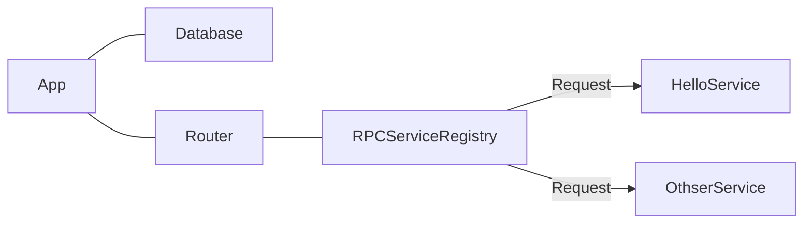

# Introduction

In this article we'll get acquainted with the elements that constitute a typical application.


Lets start with the Hello World plugin:

```typescript
class HelloService extends BaseService {
  sayHello(params: { name: string }) {
    return { greet: `Welcome ${name}` };
  }
}

export function HelloPlugin(app: App) {
  // Adds JSONRPC endpoint at '/api'
  // with method `hello.sayHello`
  app.getSingleton(RPCServiceRegistry)
     .add('hello', HelloService);
}
```

A h4bff plugin is typically defined as a function that takes the app where the plugin is loaded
as an argument. From this function, we can hook into parts of the application (typically
represented by singletons since they are created once per app instantiation).

A plugin can request, or expose two types of components: Services and Singletons. Services live
for a single HTTP Request, while singletons get instantiated and terminated with the app.


<figure class="image">



<figcaption> A simple app with two services and a few singletons </figcaption>
</figure>

In the above example we add the HelloService to the RPC Service registry, which is a RPC
endpoint installed at `/api`. The current implementation uses JSONRPC, however in the future we
plan on supporting other mechanisms like GraphQL.

When the plugin is loaded into the app, it will gain a new RPC method called `hello.sayHello`.

Besides hooking into other components, plugins can define their own classes for use by the end
users.

### Services

Services are classes or factory functions that get instantiated with every HTTP request. They also
get destroyed once the request ends. They are somewhat similar to controllers in Rails and scoped
services in NET Core.

Some services are exposed at a HTTP endpoint, such as in the above hello world example. But not all
of them need to be directly exposed - other services can use them instead.

For example, the Hello service can take advantage of a translation service to translate the hello
world message to the appropriate language for hte current user. It can do that by importing that
service from the translation plugin, then asking for an instance using the [getService][BS.GS]
method

```typescript
class HelloService extends BaseService {
  get translator() { return this.getService(TranslationService) }

  sayHello(params: { name: string }) {
    return {
      greet: formatString(this.translator.translate(`Welcome %1`), params.name) };
  }
}
```

Typical services that are present in most apps are the [RequestInfo][ReqInfoSvc] service (contains
the express request and respone objects), an app's own UserService that provides authentication
information about the current user. The Database module provides a [Transaction][TxSvc] service
which creates a database transaction that lives for a single HTTP request.

### Singletons

Singletons are classes or factory functions that get instantiated only once on app creation, and
destroyed once the application ends.

When writing plugins, Singletons are typically used:

* to define the database tables used for a specific plugin
* to define hooks and events that a plugin can expose for other plugins.

Lower level components use singleton classes to expose their functionalities too. For example, the
default database driver uses [anydb-sql][anydb-sql] to create a connection pool and to allow the
user to define tables and [build typed SQL queries](https://node-sql-examples.github.io/), and
exposes that functionality via the [Database][db] singleton.

Our Hello plugin can take advantage of this mechanism to remember the users it has said hello to:

```typescript

class HelloDB extends AppSingleton {
  private db = this.app.getSingleton(Database).db;
  usersGreeted = this.db.define({
    name: 'hello_usersGreeted',
    columns: { id: column.uuid({primaryKey: true}), name: columns.string() }
  })
}

class HelloService extends BaseService {
  get db() { return this.getSingleton(HelloDB) }

  async sayHello(params: { name: string }) {
    let userId = this.getService(CurrentUser).userId;
    if (userId) {
      try {
        await this.db.usersGreeted.insert({id: userId, name: params.name}).exec();
        return { greet: `Hello ${params.name}` };
      } catch (e) {
         return { error: 'Cannot greet user' };
      }
    }
  }
}
```

Now that we are familiar with the two building blocks of H4BFF, we can build an example comments
plugin in the [Thinking in H4BFF][tihbff] article.

[BS.GS]: /2-API/core/BaseService#getService

[ReqInfoSvc]: /2-API/backend/RequestInfo.md
[TxSvc]: /2-API/backend/TransactionProvider.md
[anydb-sql]: https://www.npmjs.com/package/anydb-sql-2
[db]: /2-API/backend/Database.md
[tihbff]: Thinking-in-h4bff.md