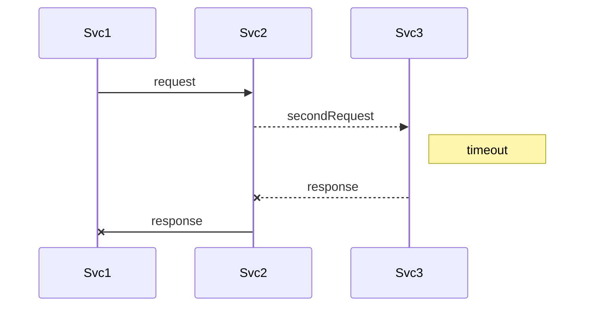

<center>


</center>

Welcome to h4bff, a new kind of TypeScript web development framework. We aim is to provide developers with tools to
write highly modular code by composing their app from multiple plugins.

<style>
#intro code {
  font-size: 13px !important;
}
</style>

<table id="intro"><tr><td style="width: 50%;">

hello-plugin.ts

```typescript
class HelloService extends BaseService {
  sayHello(params: { name: string }) {
    return { greet: `Welcome ${name}` };
  }
}

export function HelloPlugin(app: App) {
  // Adds JSONRPC endpoint at '/api'
  // with method `hello.sayHello`
  app.getSingleton(RPCServiceRegistry)
     .add('hello', HelloService);
}
```

</td><td>

hello-app.ts

```typescript
import HelloPlugin from './hello-plugin';


class HelloApp extends App {
  start() {
    this.load(HelloPlugin);
    this.getSingleton(HttpRouter).listen(8080);
  }
}


new HelloApp().start();
```

</td></tr></table>

<table><tr>
<td>


</td><td style="width: 90%;">

Traditional frameworks such as Ruby on Rails have focused on separation of technologies rather than separation of
concerns. We believe that approach results with monolitic code bases that are highly coupled and difficult to maintain.

</td></tr></table>

<table border="0"><tr>
<td style="width: 50%;">

Microservices can offer solid separation of concerns. However, the complexity of deploying and orchestrating them, as
well as the difficulty in maintaining data integrity make them an excessive choice in many cases.

</td><td>



</td></tr></table>

H4BFF aims to offer some of the benefits and drawbacks from both approaches.

- Data integrity is easier. Multiple h4bff plugins can participate in a single database transaction, and if any of them
  fails it can signal the entire process to fail.

- Deployment is easier. Its just a single application working with a single database.

- Performance is simpler to reason about. No network latency unless you want it.

- Separation is easier. A plugin can live in a single directory or a single npm package - its models, controllers
  (services), database migrations, API endpoints and everything it needs to function as a single unit.

- Because separation is easier, you can choose to separate apps into services when it makes sense to (like e.g. for
  scaling or data segregation reasons)

Interested in how this works? Check out our [introduction][intro] to get more familiar with the
framework's building blocks, then lets look at how we would build a comments plugin in the more
in-depth [Thinking in H4FF][tih4bff] guide!

[intro]: 1-Guides/Introduction.md
[tinh4bff]: 1-Guides/Thinking-in-h4bff.md
